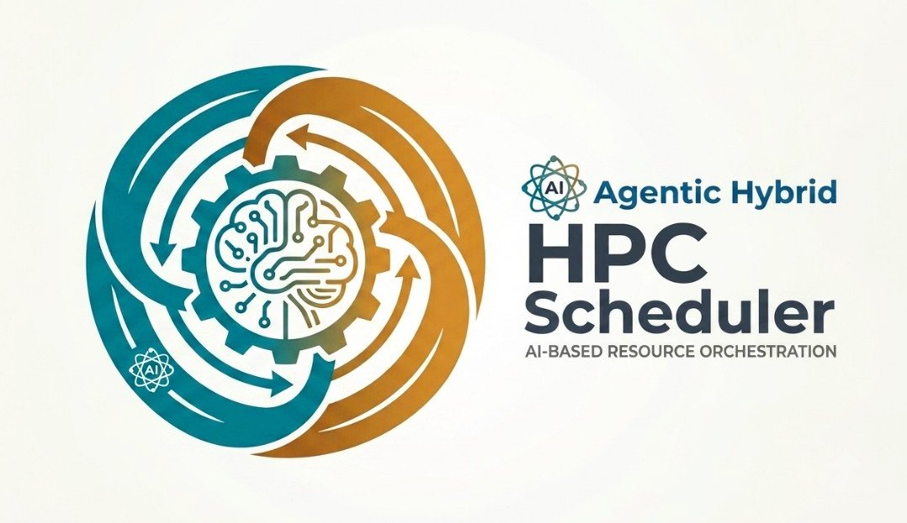
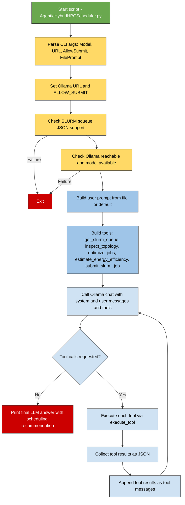

# **Agentic Hybrid HPC Scheduler**

[](https://github.com/lemoinep/Agentic-HPC-Scheduler)
[](LICENSE)
[](https://www.python.org/)

---

<p align="center">

</p>

# **Introduction**

**Agentic Hybrid HPC Scheduler with Ollama and SLURM** is a tool that combines local LLM inference with SLURM-aware cluster management to support HPC scheduling workflows. It reads the live SLURM queue, inspects node and GPU topology, ranks jobs with a simple scheduling heuristic, estimates energy-related signals, and can optionally submit jobs through `sbatch` when submission is enabled. The project is designed to help explore **agentic** decision-making in HPC environments while keeping execution practical and operational through local tools and deterministic system commands.


...




*The scheduler starts by validating SLURM JSON output and the local Ollama model, then builds a user prompt from a file or a default template. It calls Ollama with a set of HPC tools (SLURM queue, topology, job optimization, energy estimation, and optional submission), loops over tool calls, and finally prints an agentic scheduling recommendation to stdout.*

---

## Command line usage

```bash
python AgenticHybridHPCScheduler.py 
  --Model model 
  --URL http://localhost:11434 
  --Temperature 0.0 
  --AllowSubmit 
  --FilePrompt tasks.md
```

- `--Model
Name of the local Ollama model to use (default: llama3.1).

- `--URL` – Base URL of the Ollama server (default: http://localhost:11434).
- `--Speech` – Enable speech-related behavior in the agent (currently a placeholder flag).
- `--Temperature` – Sampling temperature between 0.0 and 1.0 for the LLM (default: 0.0).
- `--AllowSubmit` – If set, allow the agent to actually submit jobs with sbatch; otherwise, submit_slurm_job returns an error and does not touch SLURM.
- `--FilePrompt` – Path to a text/Markdown file containing the user tasks and instructions for the agent; if omitted, a built‑in default prompt about queue analysis and job optimization is used.

---

## 📝 **Author**

**Dr. Patrick Lemoine**  
*Engineer Expert in Scientific Computing*  
[LinkedIn](https://www.linkedin.com/in/patrick-lemoine-7ba11b72/)

---


"# Agentic-HPC-Scheduler" 
